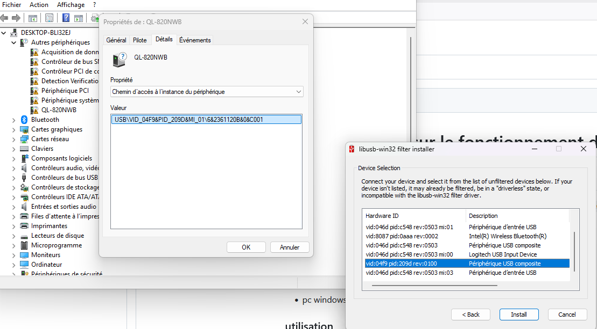

# Documentation sur le fonctionnement du script de l'imprimante
## Description 
ce script permet d'imprimer une image sur une imprimante Brother modèle ```QL-820NWB``` connecter en USB sur un pc windows

### matériel utiliser
- imprimante ```QL-820NWB```
- rouleau autocollant de type ```DK-22210``` pour les étiquette des voitures (29mm) ou ```DK-22205```
- cable USB-B vers USB-A
- pc windows 11 (nuc + clavier + souris + écran)

### utilisation 
1. installer python `3.9` cocher add to PATH (ce trouve dans le dossier nonfree)
2. cliquer sur disable PATH length limit 
3. installer les [drivers brother](https://support.brother.com/g/b/downloadend.aspx?c=ch&lang=fr&prod=lpql820nwbeuk&os=10069&dlid=dlfp101277_000&flang=185&type3=347) de l'imprimante (ce trouve dans le dossier nonfree)
4. ouvrer l’installateur
5. choisissez l'imprimante ici ``ql-820NWB``
6. sélectionner connection USB 
7. installer [libusb-win32-devel-filter](https://sourceforge.net/projects/libusb-win32/files/libusb-win32-releases/1.2.7.3/) (ce trouve dans le dossier nonfree)
8. executer le (filter installer)
9. trouver l'imprimante dans le gestionnaire de périphérique ici `ql-820NWB` 
10. cliquer dessus puis → détails → chemin d'accès à l'instance du périphérique
11. ouvrer libusb puis install a device filter
12. trouver l'imprimante et install (utilisé le code trouver dans le gestionnaire de périphérique, ne pas hésiter a installer le filtre sur plusieurs périphérique avec le meme code) 
13. aller sur le [dépôt github](https://github.com/Thex-Thex/QL-Brother-label-print) et télécharger la branches `main`
14. installer les dépendances `pip install -r requirements.txt`
15. lancer le script
16. les données contenue dans dataQR.csv seront imprimer sous la forme d'un QRcode avec le text du code en dessus